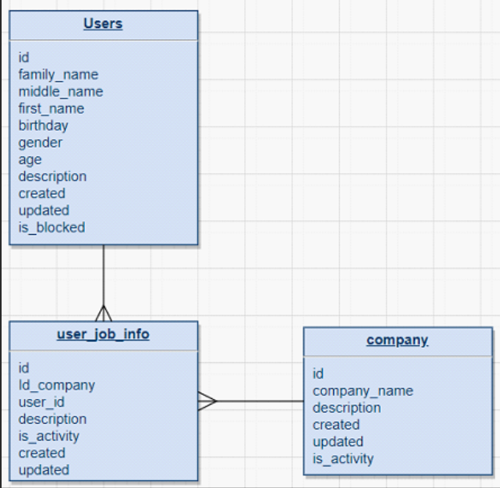
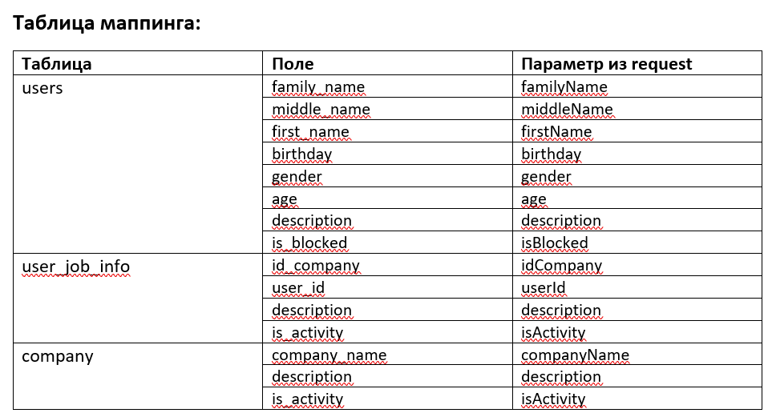

Требования к разработке userjob

Предусловие
В рамках данной спецификации требований описан механизм реализации и работы нового микросервиса (userjob-service).
Микросервис должен позволять создавать, обновлять, получать данные о пользователях и компаниях.
Требования включают в себя следующее:
1.	Разработка новой схемы в БД к микросервису согласно описанной модели данных
2.	Разработка методов микросервиса
      a.	POST - /create-userjob
      b.	PATCH - /update-userjob
      c.	GET - /get-userjob
      Модель данных
      Реализовать схему в БД согласно следующей логической модели данных.
      Создать таблицы: users, user_job_info, company.
      i.	В query запроса присутствует и заполнен параметр user

 
Методы
При первоначальном сохранении записи в БД генерировать идентификаторы и записывать время создания записи в поле created.
При обновлении записи в БД записывать время обновления в поле updated.
POST - /create-userjob
При получении запроса создавать пользователя, компанию и связку пользователь-компания в микросервисе и направлять ответ с кодом 201.
1.	ЕСЛИ
      a.	Пользователь/компания уже присутствует в БД
      i.	Проверять по id
2.	ТО
      a.	Не записывать полученные данные
      b.	Направлять ответ с кодом 409
3.	ИНАЧЕ
      a.	Записывать полученные данные в БД согласно таблице маппинга
      b.	Направлять ответ с кодом 201
      PATCH - /update-userjob
      При получении запроса обновлять те параметры, которые изменяются и направлять ответ с полным списком уже измененных параметров с кодом 200.
      Учесть, что если изменяемый объект отсутствует, то возвращать ответ с кодом 400.
      GET - /get-userjob
      При получении запроса возвращать данные из БД в зависимости от заполненности query.
1.	ЕСЛИ
      a.	Query запроса отсутствует
2.	ТО
      a.	Возвращать ответ с кодом 400
3.	ИНАЧЕ
      a.	ЕСЛИ
      i.	В query запроса присутствует и заполнен параметр user
      b.	ТО
      i.	Произвести поиск по user.id из значения параметра user в qery
1.	ЕСЛИ
      a.	Пользователь был найден
2.	ТО
      a.	Вернуть данные о пользователе и о его действующей работе (за это отвечает параметр is_activity)
3.	ИНАЧЕ
      a.	Вернуть ответ с кодом 404
      c.	ИНАЧЕ
      i.	ЕСЛИ
1.	В query запроса присутствует и заполнен параметр company
      ii.	ТО
1.	Произвести поиск по company.id из значения параметра company в query
      iii.	ИНАЧЕ
1.	Вернуть ответ с кодом 404

